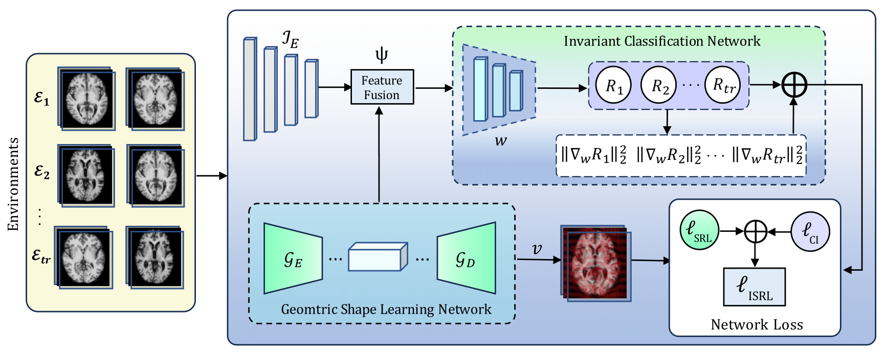

# Invariant Shape Representation Learning (ISRL)

This repository provides the PyTorch implementation of the paper, *Invariant Shape Representation Learning (ISRL)*

## Abstract

Geometric shape features have been widely used as strong predictors for image classification. Most current deep neural networks (DNNs) are designed to learn the underlying statistical correlations between the shape features and target variables. However, these correlations can often be spurious and unstable across different environments (e.g., in different age groups, certain types of brain changes have unstable relations with neurodegenerative disease), hence leading to biased or inaccurate predictions. In this paper, we introduce a novel framework that for the first time develops invariant shape representation learning (ISRL) to further strengthen the robustness of image classifiers. In contrast to existing approaches that mainly derive features in the image space, our model ISRL is designed to jointly capture invariant features in latent shape spaces parameterized by deformable transformations. To achieve this goal, we develop a new learning paradigm based on invariant risk minimization (IRM) to learn invariant representations of image and shape features across multiple training distributions/environments. With the benefits of \textcolor{red}{embedding the invariant features of image labels} into these invariant representations, our model consistently offers more accurate predictions. We validate our method by performing classification tasks on both simulated 2D images, real 3D brain and cine cardiovascular magnetic resonance images (MRIs).

